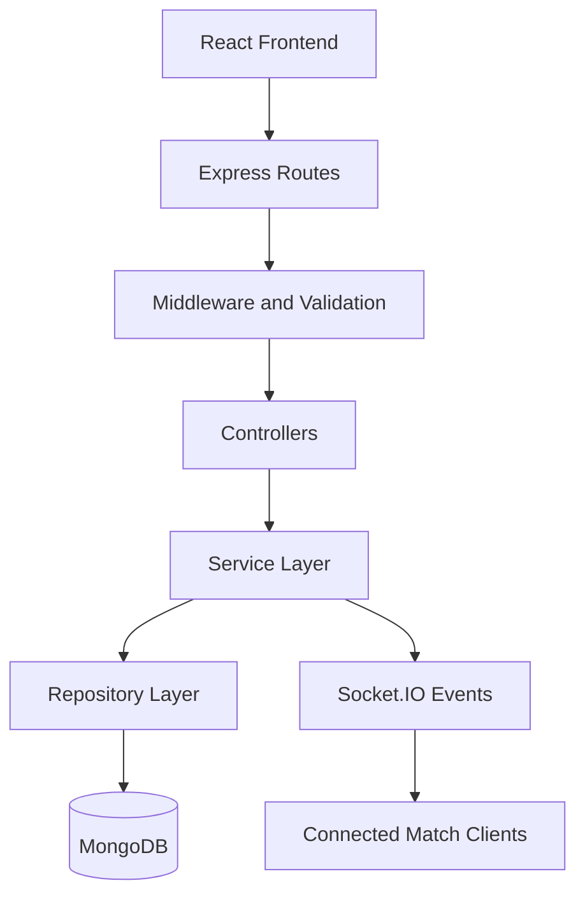
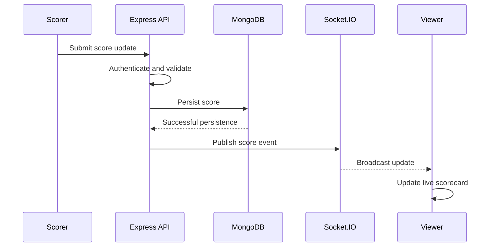
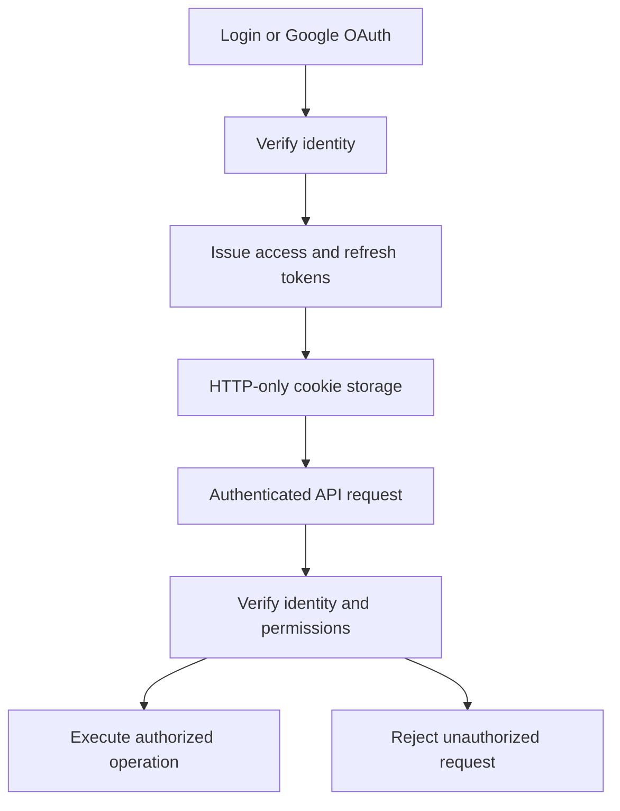

# 🏏 BoundaryLine

### Every Ball. Every Run. Every Moment.

**A real-time cricket scoring and tournament management platform built for grassroots cricket.**

BoundaryLine brings live scoring, ball-by-ball commentary, tournament management, player statistics, and real-time match updates into one platform for local leagues, cricket academies, corporate tournaments, and community competitions.

<p align="center">
  
  
  
  
  
  
</p>

<p align="center">
  <a href="#-features">Features</a> •
  <a href="#-architecture">Architecture</a> •
  <a href="#-technology-stack">Tech Stack</a> •
  <a href="#-getting-started">Getting Started</a> •
  <a href="#-documentation">Documentation</a>
</p>

---

## 🏟️ The Platform

BoundaryLine is designed to make local cricket competitions easier to organize, score, and follow.

From selecting the playing XI to publishing the final scorecard, the platform provides a structured workflow for match operations and a real-time experience for spectators.

| 🏏 Live Match Center | 🏆 Tournament Management | 📊 Player Analytics |
|:---:|:---:|:---:|
| Ball-by-ball scoring and commentary | Fixtures, teams and standings | Scorecards and player statistics |

## ✨ Features

### 🏏 Real-Time Match Scoring
- Ball-by-ball score recording and updates.
- Structured commentary for runs, wickets and extras.
- Innings and over lifecycle management.
- Real-time event broadcasting through Socket.IO.
- Match status tracking from scheduled fixtures to completion.

### 🏆 Tournament & Series Management
- Create and manage tournaments and bilateral series.
- Schedule and organize fixtures.
- Manage participating teams and squads.
- Track match results and tournament standings.
- Support local leagues, academies and community competitions.

### 👥 Team & Player Management
- Create and manage teams and player profiles.
- Assign players to tournament-specific squads.
- Select the playing XI.
- Assign captain, vice-captain and wicket-keeper roles.

### 🔐 Authentication & Authorization
- Email/password authentication.
- Google OAuth 2.0.
- JWT access and refresh token strategy.
- HTTP-only cookie-based token storage.
- Role-based access control (RBAC).
- User verification and token refresh flows.

### 📡 Real-Time Communication
- Match-specific Socket.IO rooms.
- Live score and commentary events.
- Match lifecycle notifications.
- Match join and leave events for connected clients.

---

## 🛠️ Technology Stack

<table>
  <thead>
    <tr>
      <th>Layer</th>
      <th>Technology</th>
      <th>Purpose</th>
    </tr>
  </thead>
  <tbody>
    <tr>
      <td>Frontend</td>
      <td><a href="https://react.dev/">React 19</a>, <a href="https://vite.dev/">Vite</a></td>
      <td>Interactive user interface</td>
    </tr>
    <tr>
      <td>Styling</td>
      <td><a href="https://tailwindcss.com/">Tailwind CSS 4</a></td>
      <td>Responsive UI styling</td>
    </tr>
    <tr>
      <td>Backend</td>
      <td><a href="https://nodejs.org/">Node.js</a>, <a href="https://expressjs.com/">Express.js</a></td>
      <td>REST APIs and application logic</td>
    </tr>
    <tr>
      <td>Language</td>
      <td><a href="https://www.typescriptlang.org/">TypeScript</a></td>
      <td>Type-safe application development</td>
    </tr>
    <tr>
      <td>Database</td>
      <td><a href="https://www.mongodb.com/">MongoDB</a>, <a href="https://mongoosejs.com/">Mongoose</a></td>
      <td>Persistent application data</td>
    </tr>
    <tr>
      <td>Real-Time</td>
      <td><a href="https://socket.io/">Socket.IO</a></td>
      <td>Live match event delivery</td>
    </tr>
    <tr>
      <td>Authentication</td>
      <td>JWT, Passport.js, Google OAuth 2.0</td>
      <td>Identity and access management</td>
    </tr>
    <tr>
      <td>Validation</td>
      <td><a href="https://zod.dev/">Zod</a></td>
      <td>Request and data validation</td>
    </tr>
    <tr>
      <td>State Management</td>
      <td>Redux Toolkit, TanStack Query</td>
      <td>Client state and server-state management</td>
    </tr>
    <tr>
      <td>HTTP Client</td>
      <td><a href="https://axios-http.com/">Axios</a></td>
      <td>Frontend API communication</td>
    </tr>
  </tbody>
</table>

---

## 🏗️ Architecture

BoundaryLine follows a modular **five-layer backend architecture** to separate HTTP handling, business logic, data access, and validation.



### Backend request lifecycle

| Layer | Responsibility |
|---|---|
| Routes | Define endpoints and connect middleware to controllers |
| Middleware & Validation | Authenticate requests, authorize actions, validate inputs and apply request-level controls |
| Controllers | Handle HTTP requests and construct responses |
| Services | Execute business rules and coordinate application operations |
| Repositories | Encapsulate database queries and persistence operations |
| Models | Define MongoDB document structures through Mongoose |

**Design principle:** Keep HTTP handling separate from business logic and database access. This makes individual modules easier to maintain, test and extend.

### 📂 Project Structure

```text
BoundaryLine/
├── client/
│   └── src/
│       ├── app/                 # Redux store, providers, guards
│       ├── features/            # Feature-oriented modules
│       ├── layout/              # Shared layouts
│       ├── pages/               # Page components
│       ├── routes/              # Route configuration
│       └── shared/              # Hooks, components and utilities
│
├── server/
│   ├── src/
│   │   ├── config/              # Database and environment config
│   │   ├── constant/            # Application constants
│   │   ├── middleware/          # Authentication and security
│   │   ├── model/               # Mongoose schemas
│   │   ├── modules/             # Feature modules
│   │   ├── repository/           # Data access layer
│   │   ├── shared/              # Shared utilities and errors
│   │   ├── socket/              # Socket.IO setup
│   │   └── validators/          # Validation schemas
│   ├── app.js
│   └── server.js
│
├── docs/
│   ├── backend/
│   │   ├── ARCHITECTURE.md
│   │   ├── API.md
│   │   ├── DATABASE.md
│   │   ├── MODULES.md
│   │   ├── SECURITY.md
│   │   └── SOCKET.md
│   ├── frontend/
│   │   ├── ARCHITECTURE.md
│   │   └── STATE_MANAGEMENT.md
│   ├── DEPLOYMENT.md
│   └── CONTRIBUTING.md
│
└── README.md
```

> The tree above is a logical overview based on the supplied project documentation. Adjust filenames and paths to match the actual repository.

---

## 📡 Real-Time Scoring Architecture

A live-scoring operation should follow a clear flow from the scorer's action to the spectator's screen.



The intended principle is to persist valid scoring changes before publishing corresponding updates. This helps ensure that clients are notified of accepted changes rather than uncommitted data.

### Socket.IO event catalogue

| Event category | Events |
|---|---|
| Match | `match.created`, `match.updated`, `match.started`, `match.completed`, `match.status.updated` |
| Toss | `toss.completed` |
| Playing XI | `playingXI.submitted`, `playingXI.updated` |
| Score | `score.created`, `score.updated`, `score.deleted` |
| Commentary | `commentary.created`, `commentary.updated`, `commentary.deleted` |
| Innings | `innings.started`, `innings.completed` |
| Over | `over.completed` |
| Rooms | `match.join`, `match.leave` |

Event names are documented here as the platform's event vocabulary; verify the actual payloads and emission behavior in the implementation.

---

## 🔐 Authentication & Access Control

BoundaryLine defines four user roles:

| Role | Access |
|---|---|
| `SUPER_ADMIN` | System-wide administration and user promotion |
| `ADMIN` | Match, team, player and series management |
| `SCORER` | Score and commentary operations during matches |
| `USER` | Read-only access to public resources |

### Authentication flow



Security responsibilities include validating input, protecting authentication credentials, checking authorization on the server, and restricting administrative operations to appropriate roles.

---

## 🏏 Match Lifecycle

Matches move through a defined sequence of states:

```text
UPCOMING
   ↓
TOSS_COMPLETED
   ↓
PLAYING_XI_SELECTED
   ↓
LIVE
   ↓
INNINGS_BREAK
   ↓
COMPLETED
```

State transitions should be validated on the backend so that operations such as score updates are allowed only when the match is in an appropriate state.

---

## 🗄️ Data Model Overview

The platform's principal entities include:

- **Users:** identity, authentication and roles.
- **Teams:** team details and membership.
- **Players:** player profiles and team associations.
- **Series/Tournaments:** competition metadata and participating teams.
- **Matches:** fixtures, match state and results.
- **Innings:** innings-specific match information.
- **Scores:** ball-level scoring information.
- **Commentary:** structured descriptions of match events.
- **Squads / Playing XI:** player assignments and match selections.

The exact schema fields, indexes, references and relationship cardinalities are documented in [`docs/backend/DATABASE.md`](docs/backend/DATABASE.md).

---

## 🚀 Getting Started

### Prerequisites

- Node.js and a compatible package manager.
- MongoDB instance or connection string.
- Google OAuth credentials if using Google sign-in.
- Environment configuration for the backend and frontend.

### 1. Clone the repository

```bash
git clone https://github.com/avyaanverma/BoundaryLine.git
cd BoundaryLine
```

### 2. Install dependencies

Install dependencies in the frontend and backend directories using the package manager and scripts defined by their respective `package.json` files.

```bash
cd server
npm install

cd ../client
npm install
```

### 3. Configure environment variables

Create environment files using the variables expected by the application.

Typical configuration categories include:

| Category | Purpose |
|---|---|
| MongoDB connection | Database connectivity |
| JWT secrets | Access and refresh token signing |
| Google OAuth | OAuth client configuration |
| Frontend API URL | Backend API address |
| Cookie and CORS settings | Cross-origin authentication and security |
| Socket.IO configuration | Real-time client connection settings |

**Important:** Use the exact variable names from your environment validation and deployment documentation. Do not commit `.env` files or production secrets.

### 4. Run the application

Use the development scripts defined in the frontend and backend `package.json` files. The exact commands and ports depend on your repository configuration.

---

## 📚 Documentation

Explore the detailed documentation for individual components:

| Document | Description |
|---|---|
| [Backend Architecture](docs/backend/ARCHITECTURE.md) | Layers, request lifecycle and folder structure |
| [Database Design](docs/backend/DATABASE.md) | Schemas and entity relationships |
| [Security](docs/backend/SECURITY.md) | Authentication, authorization and middleware |
| [API Reference](docs/backend/API.md) | Endpoint architecture and API documentation |
| [Socket Architecture](docs/backend/SOCKET.md) | Real-time events and communication flow |
| [Backend Modules](docs/backend/MODULES.md) | Module-level responsibilities |
| [Frontend Architecture](docs/frontend/ARCHITECTURE.md) | Frontend organization and components |
| [State Management](docs/frontend/STATE_MANAGEMENT.md) | Redux Toolkit and TanStack Query |
| [Deployment Guide](docs/DEPLOYMENT.md) | Environment configuration and deployment |
| [Contribution Guide](docs/CONTRIBUTING.md) | Developer onboarding and contribution workflow |

---

## 📈 Scalability & Future Improvements

Areas to evaluate as usage grows:

- **Database performance:** identify slow queries, add appropriate indexes and inspect query plans.
- **Concurrent scoring:** prevent conflicting score updates and preserve match-state consistency.
- **Real-time delivery:** manage room membership, reconnection, event ordering and missed updates.
- **Caching:** cache suitable read-heavy resources without serving stale live scores.
- **Horizontal scaling:** evaluate a shared Socket.IO adapter and appropriate infrastructure when multiple server instances are introduced.
- **Observability:** measure API latency, error rates, database performance and real-time event delivery.
- **Testing:** add unit, integration and concurrency tests for scoring and match lifecycle operations.

These are engineering considerations and potential improvements, not claims that every capability is already implemented.

---

## 🤝 Contributing

Contributions, bug reports and suggestions are welcome.

1. Review the project documentation.
2. Create a focused branch for your change.
3. Follow existing module and validation conventions.
4. Test your changes.
5. Submit a pull request describing the change and its impact.

See [`docs/CONTRIBUTING.md`](docs/CONTRIBUTING.md) for the onboarding guide.

---

## 👨‍💻 Project

**BoundaryLine — Real-Time Cricket Scoring & Tournament Management**

Built to make grassroots cricket more connected, accessible and easier to follow.

<p align="center">
  <strong>Every ball tells a story. BoundaryLine keeps it live.</strong>
</p>
